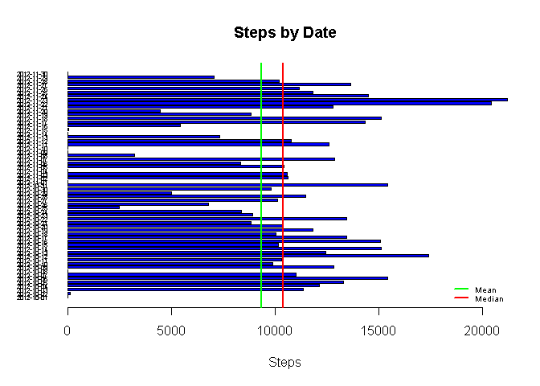
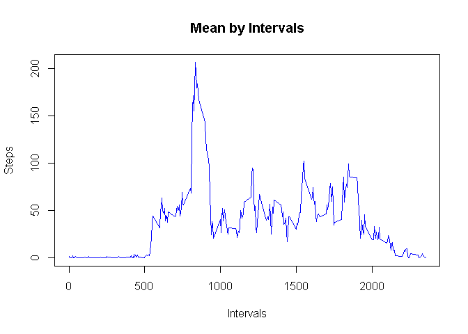
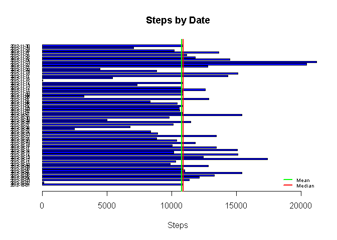
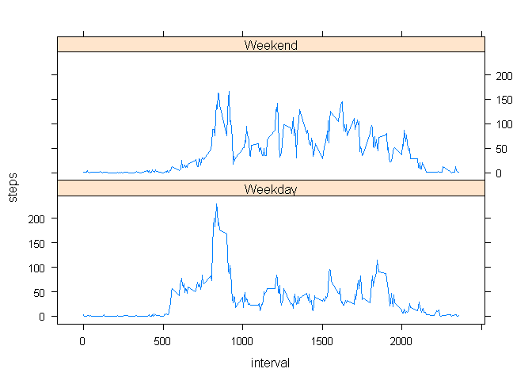

# Reproducible Research: Peer Assessment 1

## Loading and preprocessing the data
Creating a data frame called activity with the data from CSV file

```r
activity<-read.csv("activity.csv")
```
Changing data type in the "date" column

```r
activity$date<-as.Date(activity$date,"%Y-%m-%d")
```

## What is mean total number of steps taken per day?
Plotting a histogram with the total steps by date and making a calculation of mean

1. Creating a data frame called stepsByDate with the total steps

```r
library(dplyr)
stepsByDate<-group_by(activity, date)
stepsByDate<-summarise(stepsByDate, steps = sum(steps, na.rm = TRUE))
```
2. Making a calculation of mean and median

```r
meanSteps<-mean(stepsByDate$steps, na.rm=TRUE)
medianSteps<-median(stepsByDate$steps, na.rm=TRUE)
```
3. Creating a bar plot

```r
barplot(stepsByDate$steps,names.arg = stepsByDate$date, horiz = TRUE, 
    col = "blue", main = "Steps by Date", xlab = "Steps", 
    space = rep(0.5,length(stepsByDate$date)), cex.names=0.5, las = 1)
abline(v=meanSteps, lwd=2.5, col="green")
abline(v=medianSteps, lwd=2.5, col="red")
legend("bottomright", c("Mean","Median"), lty=1, lwd=2.5, col=c("green","red"), cex = 0.6, bty = "n")
```

<!-- -->

The mean total number of steps taken per day is 9354 and the median is 10395

## What is the average daily activity pattern?
Making a time series plot

1. Creating a data frame called stepsByInterval with the total steps

```r
stepsByInterval<-group_by(activity, interval)
stepsByInterval<-summarise(stepsByInterval, steps = mean(steps, na.rm = TRUE))
```
2. Creating a time series plot

```r
plot(stepsByInterval$interval, stepsByInterval$steps, type = "l", col="blue",
    ylab="Steps", xlab="Intervals", main="Mean by Intervals")
```

<!-- -->

3. Calculating the maximum value and its interval

```r
maxStep<-max(stepsByInterval$steps)
maxInterval<-as.numeric(stepsByInterval[stepsByInterval$steps==maxStep,1])
```
The maximum average steps is 206.1698113 and happens in the interval 835

## Imputing missing values
Counting NA values presented in the steps column of the activity data frame

```r
naValues<-sum(is.na(activity$steps))
```
There are 2304 NA values

Creating a new data frame without NA values. To do this, replace the NA values with the mean by intervals calculated previously. Doing a join between data frames "activity" and "stepsByInterval"

```r
newActivity<-merge(activity, stepsByInterval, by="interval")
newActivity[is.na(newActivity$steps.x),2]<-ceiling(newActivity[is.na(newActivity$steps.x),4])
newActivity<-select(newActivity, steps.x, date, interval)
names(newActivity)[1]<-"steps"
```
Plotting a histogram with the total steps by date and making a calculation of mean

1. Creating a data frame called stepsByDate with the total steps

```r
stepsByDate<-group_by(newActivity, date)
stepsByDate<-summarise(stepsByDate, steps = sum(steps))
```
2. Making a calculation of mean and median

```r
meanSteps<-mean(stepsByDate$steps)
medianSteps<-median(stepsByDate$steps)
```
3. Creating a bar plot

```r
barplot(stepsByDate$steps,names.arg = stepsByDate$date, horiz = TRUE, 
    col = "blue", main = "Steps by Date", xlab = "Steps", 
    space = rep(0.5,length(stepsByDate$date)), cex.names=0.5, las = 1)
abline(v=meanSteps, lwd=2.5, col="green")
abline(v=medianSteps, lwd=2.5, col="red")
legend("bottomright", c("Mean","Median"), lty=1, lwd=2.5, col=c("green","red"), cex = 0.6, bty = "n")
```

<!-- -->

The mean total number of steps taken per day is 10784 and the 
median is 10909

The steps by date are increased but not much. Mean and median are almost equal

## Are there differences in activity patterns between weekdays and weekends?
1. Adding a new columd to the "newActivity" data frame

```r
newActivity$dw<-sub("^(l|m|j|v).*", "Weekday", sub("^(s|d).*","Weekend",weekdays(newActivity$date)))
```
2. Making a time series plot

- Creating a data frame called stepsByInterval with the total steps

```r
stepsByInterval<-group_by(newActivity, dw, interval)
stepsByInterval<-summarise(stepsByInterval, steps = mean(steps, na.rm = TRUE))
```
- Creating a time series plot

```r
library(lattice)
xyplot(steps~interval|dw, data = stepsByInterval, type="l", layout=c(1,2))
```

<!-- -->

There are difference between the plots, there are more steps in the weekends than the weekdays
